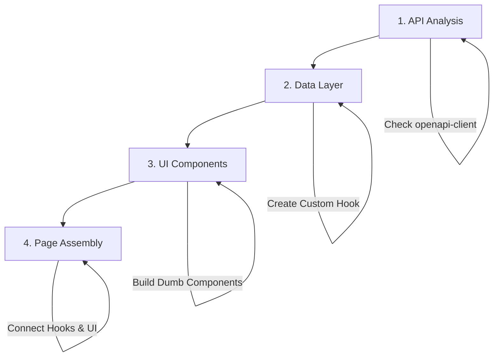

---
layout: default
title: "Frontend Template – Master Guide"
nav_order: 1
---

# Frontend Template – The One and Only Master Guide

> **CRITICAL INSTRUCTION FOR AI AGENTS:**
> **YOU MUST READ THIS FILE BEFORE DOING ANYTHING ELSE.**
> This is the absolute source of truth. Do not hallucinate a workflow. Follow this one.
> **IF A PATTERN IS NOT DOCUMENTED HERE, DO NOT USE IT.**
> **NEVER EDIT AUTO-GENERATED FILES**: Files within `frontend/src/openapi-client/` are auto-generated and MUST NOT be manually modified. Any changes will be overwritten.
{: .important }

> **METHODOLOGY & PERSONALITY:**
> If you are a developer (or AI assistant) involved in building frontend applications, read this guide VERY, VERY carefully! This establishes a standardized methodology to ensure every CRUD (Create, Read, Update, Delete) frontend project follows the same repeatable process.
> **ALWAYS**:
> 1.  Start with a **minimal viable prototype**.
> 2.  **Document designs** at a high level before coding.
> 3.  Frequently **seek feedback** or iterate on edge cases.
> 4.  **Fix all errors** (linting, TypeScript) in the current file before moving to the next feature.
{: .warning }

> **STOP AND ASK TRIGGERS:**
> 1.  **Missing Design**: If `docs/design.md` is missing or incomplete for the requested feature.
> 2.  **Ambiguity**: If the user prompt is vague (e.g., "Fix the bug" without details).
> 3.  **Manual API Calls**: If you find yourself writing `fetch` or `axios` instead of using `openapi-client`.
> 4.  **Missing OpenAPI Endpoint**: If the required data is not available through an existing function in `frontend/src/openapi-client/services.gen.ts`.
> 5.  **Phase Completion**: After a phase in `docs/progress.md` is complete.
>
> **ACTION**: Stop immediately. Ask the user for clarification or permission.
{: .warning }

> **6. Missing Information**: If any required information for design, UI, or implementation is not explicitly provided, **YOU MUST STOP** and ask the user for clarification. Do not make assumptions.
>
> **ACTION**: Stop immediately. Ask the user for clarification or permission.
{: .warning }

> **STEP 0: DESIGN FIRST**
> If `docs/project/design.md` does not exist, or if the user prompt implies a new feature/page, **YOU MUST STOP** and ask the user for the necessary information to fill out the `docs/templates/design.md` template.
> **DO NOT WRITE CODE** until `docs/project/design.md` is approved.
{: .warning }

## 0.5. Project Initialization & Cleanup
> **CRITICAL**: Before any new feature or page, you **MUST** redesign the existing project structure.
> 1.  **Remove Unnecessary Files**: Delete any files or directories not directly related to the current project's scope.
> 2.  **Rewrite Core Components**: Re-implement existing layouts, homepages, and other foundational components to align with the new project's requirements and design.
> 3.  **Ensure Functionality**: Verify that the application is fully functional after cleanup and redesign.
{: .warning }

## Mandatory Checkpoints & Documentation

### Before Starting Implementation
1. **Design Documentation**
   - [ ] Ensure `docs/project/design.md` exists and is up-to-date
   - [ ] Get explicit approval on the design before writing any code
   - [ ] Document all new components, data models, and API endpoints

2. **Progress Tracking**
   - [ ] Update `docs/project/progress.md` with the planned changes
   - [ ] Break down the work into small, testable units
   - [ ] Get confirmation on the implementation plan

### During Implementation
1. **After Each Major Component**
   - [ ] Run linting and type checking
   - [ ] Update documentation if requirements change
   - [ ] Show progress to the user for feedback

2. **Before Phase Completion**
   - [ ] Run all tests and fix any issues
   - [ ] Update `docs/project/progress.md` with completion status
   - [ ] Get user sign-off before moving to the next phase

### After Implementation
1. **Code Review**
   - [ ] Verify all code follows project patterns
   - [ ] Ensure all documentation is up-to-date
   - [ ] Run final quality checks

2. **Handoff**
   - [ ] Provide a summary of changes
   - [ ] Document any known issues or TODOs
   - [ ] Generate a detailed user manual testing guide (`docs/usertesting/user-guide.md`)
   - [ ] Get final approval before considering the task complete


## Code Quality Enforcement

### Mandatory Checks (Before Phase Completion)
- [ ] Run `npm run lint:check` and fix ALL issues
- [ ] Ensure TypeScript compiles without errors
- [ ] Run `npm run build` to verify successful compilation
- [ ] Verify all related files are error-free
- [ ] Run tests if available (`npm test`)

### Phase Completion Workflow
1. Complete all tasks in the current phase
2. Run code quality checks
3. Fix all issues
4. Update `docs/project/progress.md`:
   - Mark completed items with `[x]`
   - Add completion timestamp
   - Update code quality log
5. Only then proceed to next phase

### Error Handling
- **Never** leave a file with errors
- **Never** skip code quality checks
- **Always** fix linting/type issues immediately


## Feature Implementation Flow (The Hierarchy)

**You must build features in this exact order (Bottom-Up):**



### 1. API Analysis (The Foundation)
-   **Action**: Open `frontend/src/openapi-client/services.gen.ts`.
-   **Goal**: Find the exact method (e.g., `BooksService.createBook`).
-   **Check**: What types does it need? (`frontend/src/openapi-client/types.gen.ts`).

### 2. Data Layer (The Logic)
-   **Action**: Create a custom hook `use[Feature].ts`.
-   **Goal**: Wrap the API call in `useQuery` or `useMutation`.
-   **Rule**: **NEVER** call the API directly in the component.

### 3. UI Components (The Look)
-   **Action**: Create dumb components (receive data via props).
-   **Goal**: Build the form, table, or card using `shadcn/ui`.
-   **Rule**: Use `docs/project/ui-design.md` for styling.

### 4. Page Assembly (The Glue)
-   **Action**: Create the Page component.
-   **Goal**: Call the Hook -> Pass data to Components.

---

## Templated Frontend Coding Steps

Templated Frontend Coding is a collaboration between **Project Planning** (high-level human input) and **Implementation** (detailed coding, potentially AI-assisted):

| Steps                  | Human      | AI         | Comment                                                                 |
|:-----------------------|:----------:|:----------:|:------------------------------------------------------------------------|
| 1. Requirements        | ★★★ High  | ★☆☆ Low   | Humans define scope, users, and business context                        |
| 2. Design Documentation| ★★☆ Medium| ★★☆ Medium| **MANDATORY**: AI fills `docs/project/design.md` based on user prompt           |
| 3. **Roadmap & Phasing**| ★☆☆ Low   | ★★★ High  | **CRITICAL**: AI creates `docs/project/progress.md` to track state across chats |
| 4. Utilities & Libs    | ★★☆ Medium| ★★☆ Medium| Humans pick stack → AI scaffolds setup                                  |
| 5. Data Schema         | ★☆☆ Low   | ★★★ High  | AI creates types, API contracts, constants → humans verify             |
| 6. Components & Hooks  | ★☆☆ Low   | ★★★ High  | AI generates all reusable pieces based on design                        |
| 7. Implementation      | ★☆☆ Low   | ★★★ High  | AI builds the full app following `docs/progress.md` checklist           |
| 8. Optimization        | ★★☆ Medium| ★★☆ Medium| Humans test usability → AI refines performance                         |
| 9. Reliability         | ★☆☆ Low   | ★★★ High  | AI writes tests, i18n, error boundaries, etc.                           |

### Detailed Breakdown (you must follow this order every single time)

1. **Requirements**  
   Clarify the project goals and confirm a templated CRUD app is the right fit.

2. **Design Documentation** → **MANDATORY STEP**
   - **Action**: Check if `docs/project/design.md` exists.
   - **If NO**: Use `docs/templates/design.md` to ask the user for details. Create `docs/project/design.md`.
   - **If YES**: Update it with new feature details.
   - **Content**: One-line description per page, Mermaid flow diagrams, Routing table, i18n plan.

2.5. **UI Design Documentation (The "Lovable Standard")** → **CRITICAL STEP**
   - **Action**: Check if `docs/project/ui-design.md` exists.
   - **If NO**: Use the new, highly detailed `docs/templates/ui-design.md` to ask the user for the application's visual identity. Create `docs/project/ui-design.md`. **DO NOT PROCEED WITHOUT APPROVAL.**
   - **If YES**: Review and update it with any new UI requirements.
   - **Goal**: To produce an elegant, beautiful, and intuitive UI that matches the quality of top-tier applications. A poor or basic UI is not acceptable.
   - **Rule**: **EVERY** UI component, page, and layout **MUST** strictly adhere to the principles and specifications defined in `docs/project/ui-design.md`. This includes the header, which must match the application's theme.

3. **Roadmap & Progress Tracking** → **TOKEN MANAGEMENT SAVER**
   - **Action**: Check if `docs/project/progress.md` exists.
   - **If NO**: Create it using `docs/templates/progress.md`. Break the project into Phases.
   - **If YES**: Read it to see what is next.
   - **Rule**: **NEVER** try to build the whole app in one go. Build one Phase, mark it complete, then ask user to restart chat.

3. **Utilities & Libs** → see `docs/api-integration.md`
4. **Data Schema & Constants** → see `docs/data-types.md`
5. **Components & Hooks** → see `docs/components.md`, `docs/hooks.md`, and **`docs/project/ui-design.md`** (for styling rules)
6. **Pages Implementation** → **MUST READ** `docs/pages.md` (the bible for every new CRUD page)
7. **Authentication** → see `docs/authentication.md`
8. **Internationalization** → see `docs/internationalization.md`

## Official Folder Structure (never deviate)

```
my_crud_app/
├── frontend/
│   ├── src/
│       ├── components/       → Reusable UI (see docs/components.md)
│       │   ├── ui/           → Atomic components (shadcn/ui)
│       │   └── shared/       → App-specific shared components
│       ├── constants/        → Enums, roles (see docs/data.md)
│       ├── context/          → React Contexts (Auth, Theme)
│       ├── hooks/            → Custom hooks (see docs/hooks.md)
│       ├── layouts/          → MainLayout, AuthLayout (see docs/layout.md)
│       ├── openapi-client/   → Generated API client
│       ├── pages/            → Full pages – **follow docs/pages.md exactly**
│       ├── router/           → Router configuration
│       ├── services/         → Business logic & API calls (see docs/api-integration.md)
│       ├── types/            → TypeScript interfaces
│       ├── App.tsx
│       └── main.tsx
├── docs/                 → ALL documentation lives here
│   ├── intro.md          ← YOU ARE HERE
│   ├── project/          ← Project-specific documentation
│   │   ├── design.md     ← Project-specific design (create per project)
│   │   ├── ui-design.md  ← Project-specific UI design
│   │   └── progress.md   ← Project progress tracking
│   ├── pages.md          ← How to implement any CRUD page
│   ├── forms.md          ← Form patterns (Zod + React Hook Form)
│   ├── tables.md         ← Table patterns (TanStack Table)
│   ├── authentication.md ← Keycloak Auth & Protected Routes
│   ├── internationalization.md ← Multilanguage setup
│   ├── api-integration.md ← OpenAPI & TanStack Query
│   ├── components.md     ← Component standards
│   ├── hooks.md          ← Hook standards
│   ├── security.md       ← Security best practices
│   └── ...               ← One file per major topic
└── tests/
```

## Where to Find the Answer to Literally Anything

| You want to…                              | → Open this exact file                              | Path                     |
|-------------------------------------------|------------------------------------------------------|--------------------------|
| Create a new CRUD page (list + form)      | → **docs/pages.md** (start here every time)          | `docs/pages.md`          |
| **Design a Beautiful, Elegant UI**        | → **docs/project/ui-design.md** (The Lovable Standard)       | `docs/project/ui-design.md`      |
| Build a Form (Zod + React Hook Form)      | → **docs/forms.md**                                  | `docs/forms.md`          |
| Build a Table (TanStack Table)            | → **docs/tables.md**                                 | `docs/tables.md`         |
| Implement login / logout / protected routes| → Authentication guide                               | `docs/authentication.md` |
| Add a new language                        | → Internationalization guide                         | `docs/internationalization.md` |
| Call the backend API                      | → API client & error handling                        | `docs/api-integration.md` |
| Create a reusable component               | → Component standards                                | `docs/components.md`     |
| Write a custom hook                       | → Hook standards                                     | `docs/hooks.md`          |
| Set up routing & lazy loading             | → Routing & guards                                   | `docs/routing.md`        |
| Change theme / layout                     | → Layout & UI theme                                  | `docs/layout.md`         |
| Add tests                                 | → Testing strategy                                   | `docs/testing.md`        |
| Deploy                                    | → Deployment & env vars                              | `docs/deployment.md`     |
| Follow security best practices            | → Security guide (XSS, Auth, OWASP)                  | `docs/security.md`       |

## AI Chain of Thought (Follow this for every prompt)

1.  **Analyze Request**: What is the user asking for? (New Page? Bug Fix? Refactor?)
2.  **Design Documentation (docs/project/design.md)**:
    -   **Action**: Check if `docs/project/design.md` exists.
    -   **If NO**: Use `docs/templates/design.md` to ask the user for details. Create `docs/project/design.md`. **STOP and ask for user approval.**
    -   **If YES**: Update it with new feature details.
3.  **Roadmap & Progress Tracking (docs/project/progress.md)**:
    -   **Action**: Check if `docs/project/progress.md` exists.
    -   **If NO**: Create it using `docs/templates/progress.md`. Break the project into Phases. **STOP and ask for user approval.**
    -   **If YES**: Read it to see what is next.
4.  **UI Design Documentation (The "Lovable Standard")**:
    -   **Action**: Check if `docs/project/ui-design.md` exists.
    -   **If NO**: Use `docs/templates/ui-design.md` to gather the required information for a premium UI. Create `docs/project/ui-design.md`. **STOP and ask for user approval.**
    -   **If YES**: Review and confirm it aligns with the current task.
    -   **Requirement**: The output **MUST** be a unique, elegant, and beautiful design. Do not create generic, cookie-cutter UIs. Every detail, from the header to the buttons, must be intentionally designed according to the "Lovable Standard" defined in the template.
5.  **Plan Files**:
    -   Need a new type? -> `frontend/src/types/`
    -   Need data? -> `frontend/src/hooks/` (wrap OpenAPI)
    -   Need a form? -> Read `docs/forms.md`
    -   Need a table? -> Read `docs/tables.md`
    -   Need a page? -> Read `docs/pages.md`
6.  **Execute**: Write code following the patterns in the docs EXACTLY.
    -   **Constraint**: Fix all errors in the current file immediately. Do not leave broken code.
7.  **Verify**: Check against `docs/testing.md`.

> From this day forward, the only acceptable answer to any “How do I…?” question is:  
> **“Check src/docs/intro.md – it tells you exactly which file to read.”**

You now have a bulletproof, self-documenting, AI-ready frontend template.


## Code Style Enforcement

1.  **Strict Types**: No `any`. Use `unknown` if absolutely necessary.
2.  **Named Exports**: Always use `export const Component = ...`. No `export default`.
3.  **Functional Components**: Use `React.FC<Props>` or `({ prop }: Props)`.
4.  **Imports**: Use absolute imports `@/components/...`.
5.  **Comments**: JSDoc for complex logic, but prefer self-documenting code.

## Modularity & Best Practices (The "Anti-Monolith" Rule)

> **CRITICAL**: We build **maintainable**, **scalable** software.
> **NEVER** create massive files (e.g., > 200 lines) if it can be avoided.

1.  **Single Responsibility Principle (SRP)**:
    -   A file should do **ONE** thing well.
    -   If a component has `useEffect`, `useState`, and complex UI -> **Split it**.
    -   Move logic to `hooks/`. Move sub-components to separate files.

2.  **One Component Per File**:
    -   Do not define multiple components in one file.
    -   Exception: Tiny, non-reusable sub-components used *only* in that file (and even then, prefer splitting).

3.  **DRY (Don't Repeat Yourself)**:
    -   If you copy-paste code twice, refactor it into a utility or hook.

4.  **Feature Folders**:
    -   Group related files by feature, not just type.
    -   `components/users/UserTable.tsx`, `components/users/UserForm.tsx`.

**Your very next action when starting any new feature or page:**  
Open `docs/pages.md` and follow it step by step.
```

This single file is now your permanent entry point. Everything else is strictly linked from here. No more scattered knowledge!