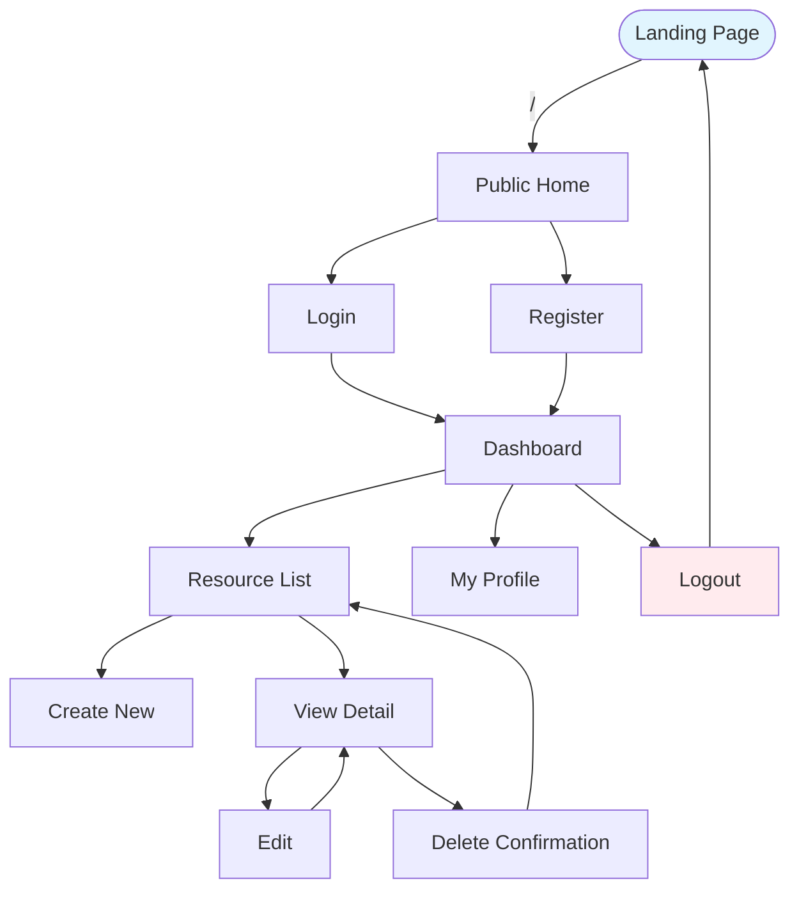

# Design Document: {{ PROJECT_NAME }}

> **CRITICAL INSTRUCTION FOR ANY DEVELOPER OR AI**  
> You **MUST** fill this entire document with the user/client before writing a single line of code.  
> If any section is empty or says "[FILL ME]", **STOP** and ask the user for the missing information.  
> This file is the contract. Nothing gets built until this is signed off.

{: .warning }

> **6. Missing Information**: If any required information for design, UI, or implementation is not explicitly provided, **YOU MUST STOP** and ask the user for clarification. Do not make assumptions.
>
> **ACTION**: Stop immediately. Ask the user for clarification or permission.
{: .warning }

## 1. Project Name & One-Line Description
**Project Name:**  
**Tagline (max 12 words):** What does this app do and for whom?

## 2. Target Users & Roles
List every user type that will log in or use the app:
- Admin
- Manager
- Regular User
- Guest / Public
- …

## 3. Core User Stories (MVP only)
Only the features that will be delivered in the first version.

```
As a [Role], I want to [Action] so that [Benefit].
```

(Write at least 5–10 stories. Prioritize ruthlessly.)

## 4. Full App Flow (Mermaid)
Draw the complete user journey from landing to logout.



## 5. Complete Routes & Pages Table

| Route                | Page Component Name         | Description                                  | Access     | Notes                     |
|----------------------|-----------------------------|----------------------------------------------|------------|---------------------------|
| `/`                  | HomePage                    | Public landing / marketing                   | Public     |                           |
| `/login`             | LoginPage                   | Email + password                             | Public     |                           |
| `/dashboard`         | DashboardPage               | Main overview after login                    | Private    |                           |
| `/users`             | UserListPage                | Paginated table + search + filters           | Private    | Admin only?               |
| `/users/new`         | UserCreatePage              | Create form                                  | Private    |                           |
| `/users/:id`         | UserDetailPage              | View single user                             | Private    |                           |
| `/users/:id/edit`    | UserEditPage                | Edit form (same as create but pre-filled)    | Private    |                           |
| …                    | …                           | …                                            | …          |                           |

## 6. Data Models (TypeScript interfaces)

```typescript
// Example – replace with real models
interface User {
  id: string;
  name: string;
  email: string;
  role: 'admin' | 'user' | 'manager';
  avatar?: string;
  createdAt: string;
  status: 'active' | 'inactive';
}

interface Product {
  id: string;
  title: string;
  price: number;
  categoryId: string;
}
```


## 7. Tech Stack & Libraries (final decision)

- **Framework**: React + Vite   OR   Next.js 14 (App Router)
- **Styling**: Tailwind CSS + shadcn/ui   OR   Chakra   OR   MUI
- **State Management**: Zustand   OR   Redux Toolkit   OR   Context only
- **Data Fetching**: TanStack Query (React Query)   OR   SWR
- **Forms & Validation**: React Hook Form + Zod
- **Auth**: Optional → Options: Supabase, Firebase, Custom JWT + HttpOnly cookies, Mock Authentication
- **i18n**: Yes / No → Languages: __________
- **Deployment**: Vercel   OR   Netlify   OR   Custom server

## 8. Non-Functional Requirements
- Mobile responsive? Yes / No
- Offline support needed? Yes / No
- Dark mode? Yes / No
- Accessibility (a11y) level: Basic / WCAG AA

## 9. Open Questions / Decisions Needed
(Bullet list – must be resolved before coding starts)
- Do we need role-based access control?
- Should delete be soft-delete or hard-delete?
- …

---

