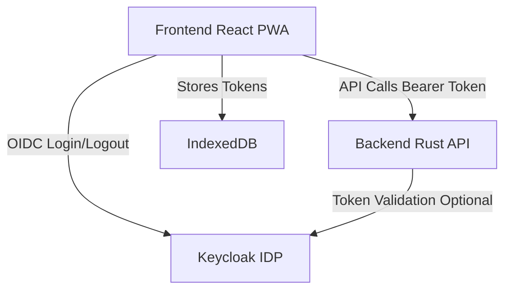
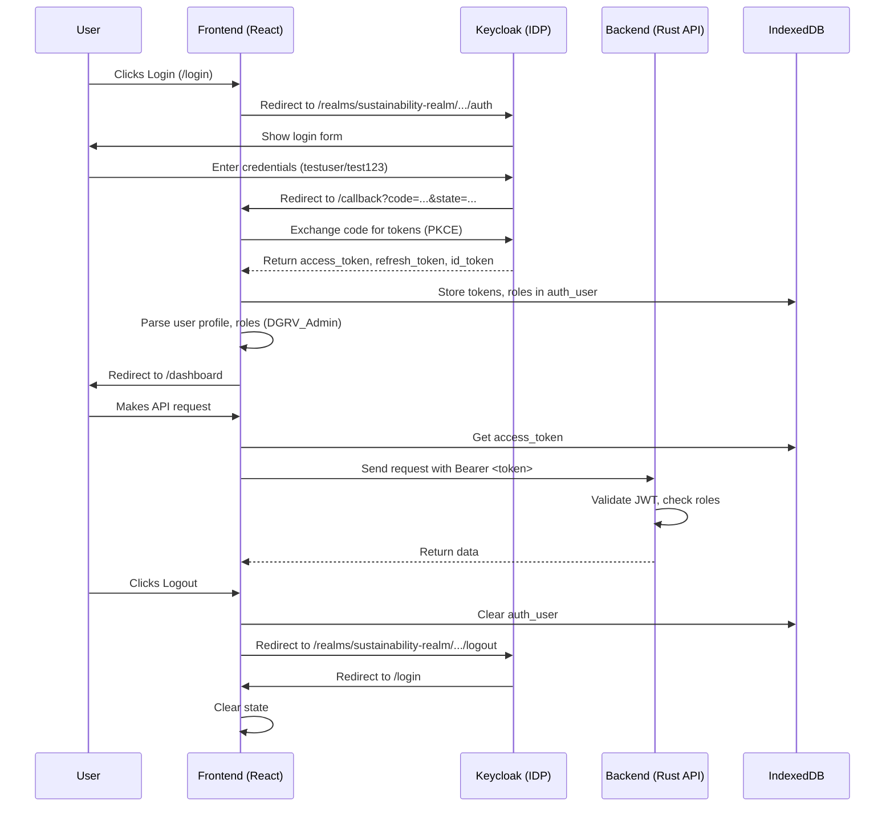
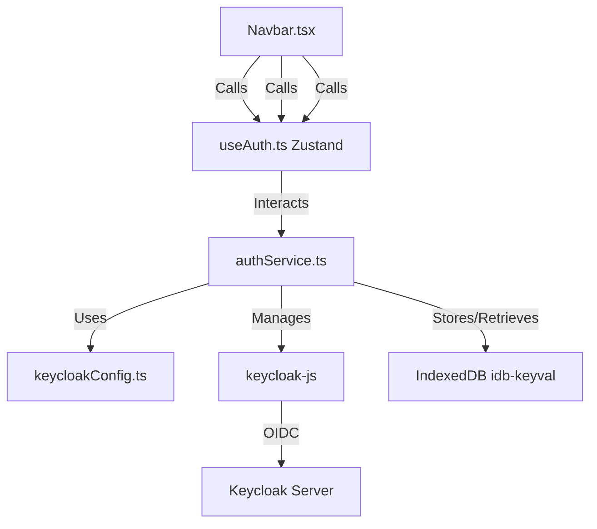

# Keycloak Authentication Guide for DGAT Assessment Tool

This document provides a comprehensive, clear, and professional guide to integrating Keycloak authentication and authorization into the DGAT Assessment Tool, a React-based Progressive Web App (PWA) with an offline-first architecture and a Rust-based backend. It addresses the specific issue where, after clearing local data (e.g., IndexedDB `auth_user`), clicking "Login" redirects directly to `/dashboard` instead of the Keycloak login page due to a persistent Single Sign-On (SSO) session. The guide includes corrected Mermaid diagrams, implementation details, security best practices, configuration, testing, and troubleshooting.

## Table of Contents

- [Keycloak Authentication Guide for DGAT Assessment Tool](#keycloak-authentication-guide-for-dgat-assessment-tool)
  - [Table of Contents](#table-of-contents)
  - [Overview](#overview)
  - [Architecture Overview](#architecture-overview)
    - [Architecture Diagram](#architecture-diagram)
  - [Authentication Sequence Diagram](#authentication-sequence-diagram)
  - [Component Interaction Diagram](#component-interaction-diagram)
  - [Flow Description](#flow-description)
    - [Login](#login)
    - [Authenticated API Call](#authenticated-api-call)
    - [Logout](#logout)
  - [Architecture \& Key Files](#architecture--key-files)
  - [Security Best Practices](#security-best-practices)

## Overview

The DGAT Assessment Tool uses [Keycloak](https://www.keycloak.org/) for secure authentication and role-based access control (RBAC) via the OpenID Connect (OIDC) Authorization Code Flow with Proof Key for Code Exchange (PKCE). The `keycloak-js` library handles frontend authentication, replacing `oidc-client-ts` to resolve issues like CORS, 404 errors, and `redirect_uri` mismatches. Key features include:

- **Login/Logout**: Users authenticate via Keycloak at `http://localhost:8080/realms/sustainability-realm/protocol/openid-connect/auth`.
- **Tokens**: Access, refresh, and ID tokens are stored in IndexedDB for offline access.
- **RBAC**: Roles (e.g., `DGRV_Admin`, `Org_User`, `org_admin`, `Org_Expert`) are checked in the frontend for UI/routing and enforced in the backend for API security.
- **Issue Addressed**: Clearing local data (e.g., IndexedDB `auth_user`) should force a logout and redirect to the Keycloak login page, but a persistent SSO session causes automatic re-authentication to `/dashboard`.

## Architecture Overview

The system comprises three main components:

- **Frontend (React PWA)**: Built with React and Vite, hosted at `http://localhost:5173` locally (or `https://dgrv-sustainability.netlify.app` in production), handles UI, authentication redirects, and token storage in IndexedDB.
- **Keycloak (Identity Provider)**: Runs at `http://localhost:8080`, manages authentication, user management, and token issuance.
- **Backend (Rust API)**: Validates JWTs, enforces RBAC, and serves protected resources (e.g., `POST /organizations`, `POST /users`).

### Architecture Diagram

**Explanation**:

- **Frontend ↔ Keycloak**: Uses `keycloak-js` for OIDC authentication, redirecting to Keycloak for login/logout.
- **Frontend ↔ Backend**: Sends API requests with `Authorization: Bearer <token>`.
- **Frontend ↔ IndexedDB**: Stores tokens using `idb-keyval` for offline access.
- **Backend ↔ Keycloak**: Validates JWTs or uses Keycloak’s Admin API for user management (e.g., `POST /admin/realms/sustainability-realm/users`).

## Authentication Sequence Diagram

**Notes**:

- The `/callback` route (`/src/pages/user/Callback.tsx`) handles token exchange and redirects to `/dashboard`.
- The issue (direct redirect to `/dashboard` after clearing data) occurs because `keycloak-js` (`check-sso`) detects an active SSO session and authenticates silently.

## Component Interaction Diagram

**Explanation**:

- **React Components**: `Login.tsx`, `Callback.tsx`, `Navbar.tsx` trigger authentication actions.
- **useAuth.ts**: Zustand store for auth state (`isAuthenticated`, `roles`, `profile`).
- **authService.ts**: Wraps `keycloak-js` for login, logout, and token management.
- **keycloakConfig.ts**: Defines Keycloak settings (URL, realm, client ID).
- **IndexedDB**: Stores tokens using `idb-keyval`.
- **Keycloak Server**: Handles authentication and token issuance at `http://localhost:8080`.

## Flow Description

### Login

1. User navigates to `/login` (`/src/pages/user/Login.tsx`) and clicks “Sign in with Keycloak”.
2. `authService.login()` triggers `keycloak-js` to redirect to Keycloak’s login endpoint (`http://localhost:8080/realms/sustainability-realm/protocol/openid-connect/auth`).
3. User enters credentials (e.g., `testuser`/`test123`).
4. Keycloak redirects to `/callback` (`/src/pages/user/Callback.tsx`) with an authorization code.
5. `authService.handleCallback()` exchanges the code for tokens, stores them in IndexedDB (`auth_user`), and updates the Zustand store (`useAuth`).
6. User is redirected to `/dashboard` based on roles (e.g., `DGRV_Admin`).

### Authenticated API Call

1. A component (e.g., `/src/pages/dashboard/Dashboard.tsx`) calls an API (e.g., `POST /organizations`).
2. `authService.getToken()` retrieves a fresh access token from `keycloak-js` or IndexedDB, refreshing if needed.
3. The request is sent with `Authorization: Bearer <token>`.
4. The Rust backend validates the JWT and checks roles (e.g., `DGRV_Admin`).
5. The backend returns protected data.

### Logout

1. User clicks “Logout” in `Navbar.tsx`.
2. `authService.logout()` clears IndexedDB (`auth_user`) and redirects to Keycloak’s logout endpoint (`http://localhost:8080/realms/sustainability-realm/protocol/openid-connect/logout`).
3. Keycloak terminates the SSO session and redirects to `/login`.
4. The frontend clears the Zustand state.

**Issue**: Clearing IndexedDB manually (e.g., via dev tools) doesn’t terminate the Keycloak SSO session, causing `keycloak-js` to re-authenticate and redirect to `/dashboard`.

## Architecture & Key Files

| File/Component                           | Purpose                                                                    |
| ---------------------------------------- | -------------------------------------------------------------------------- |
| `/src/services/shared/keycloakConfig.ts` | Defines Keycloak settings (URL, realm, client ID).                         |
| `/src/services/shared/authService.ts`    | Manages authentication (login, logout, token refresh) using `keycloak-js`. |
| `/src/hooks/shared/useAuth.ts`           | Zustand store for auth state (`isAuthenticated`, `roles`, `profile`).      |
| `/src/pages/user/Login.tsx`              | Renders login UI and triggers `authService.login()`.                       |
| `/src/pages/user/Callback.tsx`           | Handles Keycloak redirect, token exchange, and navigation.                 |
| `/src/components/shared/Navbar.tsx`      | Provides login/logout UI.                                                  |
| `/src/router/ProtectedRoute.tsx`         | Protects routes based on auth state and roles.                             |
| `/src/services/shared/storageService.ts` | Manages IndexedDB storage (uses `idb-keyval`).                             |
| `/src/types/auth.ts`                     | TypeScript types for user profile and roles.                               |
| `/frontend/.env`                         | Environment variables for Keycloak configuration.                          |
| `/src/__tests__/Login.test.tsx`          | Cypress tests for login/logout flows.                                      |

**JSDoc**: All exported functions in `authService.ts` include JSDoc comments for clarity.

## Security Best Practices

- **Token Storage**: Store tokens in IndexedDB (`auth_user` key) using `idb-keyval`, avoiding localStorage or cookies to prevent XSS attacks.
- **Token Refresh**: Use `keycloak.updateToken(30)` to ensure valid tokens for API calls.
- **Logout**: Clear IndexedDB and terminate Keycloak SSO session to prevent unauthorized access.
- **RBAC**: Enforce role checks (e.g., `DGRV_Admin`) in both frontend (`ProtectedRoute.tsx`) and backend (Rust API).
- **Input Sanitization**: Escape user data (e.g., profile details) before DOM rendering to prevent XSS.
- **Environment Variables**: Store sensitive Keycloak settings in `.env`, excluded from version control using `.gitignore`.
- **PKCE**: Enabled by default in `keycloak-js` for secure SPA authentication.
- **HTTPS**: Use HTTPS in production (e.g., `https://dgrv-sustainability.com`) for secure token transmission.
- **Required User Actions**: Use “Update Password” for new users to enforce secure initial logins.
- **Session Management**: Limit SSO session duration (e.g., 30 minutes idle) to reduce risk.
