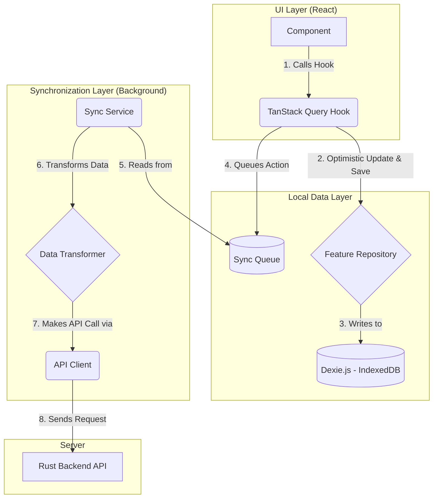
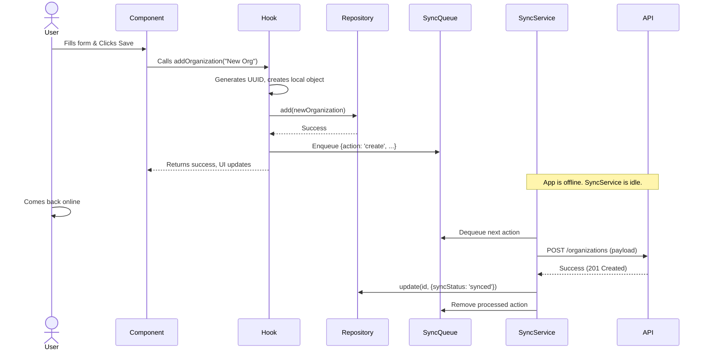

# DGAT Offline-First Architecture: A Developer's Handbook

This document provides a comprehensive, step-by-step guide to implementing robust offline-first functionality in the DGAT application. It is intended to be the definitive reference for developers.

**Chosen Stack:**

- **State Management:** TanStack Query (React Query)
- **Local Database:** Dexie.js (a wrapper for IndexedDB)

---

## 1. Core Concepts

- **Local-First Data:** The application's "source of truth" is always the local IndexedDB. The UI reads from and writes to the local database exclusively. This makes the app fast and reliable, regardless of network status.
- **Optimistic UI:** When a user performs an action (e.g., creating an item), the UI updates instantly, _before_ the data has been sent to the server. This provides a seamless user experience.
- **Background Synchronization:** A dedicated `SyncService` runs in the background. Its sole job is to communicate with the server: pushing local changes and pulling remote updates. This process is entirely decoupled from the UI.
- **Sync Status & Conflict Resolution:** Every piece of data stored locally has a status (`synced`, `pending`, `error`). This is crucial for providing feedback to the user and for handling conflicts when data is modified in multiple places.

---

## 2. Architectural Diagram



---

## 3. Part 1: The Shared Infrastructure (Build Once)

This is the foundation for all offline functionality.

### `src/types/sync.ts`

Defines the core types for our offline system.

```typescript
export type SyncStatus = "synced" | "pending" | "error";

export interface OfflineEntity {
  id: string; // Must be a client-generated UUID
  syncStatus: SyncStatus;
  lastModified: string; // ISO 8601 timestamp
}

export interface SyncQueueItem {
  id?: number;
  entity: "organization" | "assessment" | "user"; // Add new entities here
  action: "create" | "update" | "delete";
  payload: any;
  retries?: number;
  error?: string;
}
```

### `src/services/db.ts`

Initializes the Dexie database and defines the schema.

```typescript
import Dexie, { Table } from "dexie";
import { Organization } from "@/types/organization"; // Example
import { SyncQueueItem } from "@/types/sync";

export class AppDatabase extends Dexie {
  organizations!: Table<Organization>;
  sync_queue!: Table<SyncQueueItem>;

  constructor() {
    super("DGATDatabase");
    this.version(1).stores({
      // Define a table for each feature
      organizations: "id, name, syncStatus, lastModified",
      // The queue for all offline actions
      sync_queue: "++id",
    });
  }
}

export const db = new AppDatabase();
```

### `src/services/apiClient.ts`

A standard, centralized Axios instance for making API calls.

```typescript
import axios from "axios";

export const apiClient = axios.create({
  baseURL: import.meta.env.VITE_API_BASE_URL,
  headers: { "Content-Type": "application/json" },
});
```

### `src/services/syncService.ts`

The brain of the operation. This is a conceptual, detailed implementation.

```typescript
import { db } from "./db";
import { organizationAPI } from "./organizations/organizationAPI"; // Example
import { organizationRepository } from "./organizations/organizationRepository"; // Example

// A registry to map entity names to their handlers
const entityHandlers = {
  organization: {
    api: organizationAPI,
    repo: organizationRepository,
  },
  // Add other entities here as they are created
};

class SyncService {
  private isSyncing = false;

  async processQueue() {
    if (this.isSyncing || !navigator.onLine) return;
    this.isSyncing = true;

    const queueItems = await db.sync_queue.toArray();
    if (queueItems.length === 0) {
      this.isSyncing = false;
      return;
    }

    for (const item of queueItems) {
      try {
        const handler = entityHandlers[item.entity];
        let result;
        switch (item.action) {
          case "create":
            result = await handler.api.create(item.payload);
            break;
          case "update":
            result = await handler.api.update(item.payload.id, item.payload);
            break;
          case "delete":
            result = await handler.api.delete(item.payload.id);
            break;
        }

        // On success, update local status and remove from queue
        if (item.action !== "delete") {
          await handler.repo.update(item.payload.id, { syncStatus: "synced" });
        }
        await db.sync_queue.delete(item.id!);
      } catch (error) {
        console.error("Sync failed for item:", item, error);
        // Implement retry logic or mark as error
        await db.sync_queue.update(item.id!, {
          error: (error as Error).message,
        });
      }
    }

    this.isSyncing = false;
  }

  start() {
    // Run every 30 seconds
    setInterval(() => this.processQueue(), 30000);
    // Run when the app comes back online
    window.addEventListener("online", () => this.processQueue());
    // Initial run
    this.processQueue();
  }
}

export const syncService = new SyncService();
```

---

## 4. Part 2: Tutorial - Making "Organizations" Offline-Capable

### Step 1: Define the Type (`src/types/organization.ts`)

```typescript
import { OfflineEntity } from "./sync";

export interface Organization extends OfflineEntity {
  name: string;
  // ... other organization-specific fields
}
```

### Step 2: Create the API Service (`src/services/organizations/organizationAPI.ts`)

This file handles direct communication with the server.

```typescript
import { apiClient } from "../apiClient";
import { Organization } from "@/types/organization";

export const organizationAPI = {
  getAll: async (): Promise<Organization[]> => {
    const { data } = await apiClient.get("/organizations");
    return data;
  },
  create: async (org: Omit<Organization, "syncStatus" | "lastModified">) => {
    const { data } = await apiClient.post("/organizations", org);
    return data;
  },
  // ... update and delete methods
};
```

### Step 3: Create the Data Transformer (`src/services/organizations/organizationTransformer.ts`)

This file decouples your API data structure from your local data structure.

```typescript
import { Organization } from "@/types/organization";

// From the API format to the local format
export const toLocal = (apiOrg: any): Organization => ({
  id: apiOrg.id,
  name: apiOrg.officialName, // Example: API uses 'officialName'
  syncStatus: "synced",
  lastModified: apiOrg.updated_at,
  // ... transform other fields
});

// From the local format to the API format for a 'create' operation
export const toApiCreate = (localOrg: Organization) => ({
  id: localOrg.id,
  officialName: localOrg.name,
  // ... transform other fields
});
```

### Step 4: Create the Repository (`src/services/organizations/organizationRepository.ts`)

This file handles direct communication with the local database.

```typescript
import { db } from "../db";
import { Organization } from "@/types/organization";

export const organizationRepository = {
  getAll: () => db.organizations.toArray(),
  add: (org: Organization) => db.organizations.add(org),
  update: (id: string, changes: Partial<Organization>) =>
    db.organizations.update(id, changes),
  delete: (id: string) => db.organizations.delete(id),
};
```

### Step 5: Create the Hooks (`src/hooks/organizations/`)

This is how the UI interacts with the system.

**`useOrganizations.ts` (for reading data)**

```typescript
import { useQuery } from "@tanstack/react-query";
import { organizationRepository } from "@/services/organizations/organizationRepository";

export const useOrganizations = () => {
  return useQuery({
    queryKey: ["organizations"],
    queryFn: () => organizationRepository.getAll(),
  });
};
```

**`useAddOrganization.ts` (for writing data)**

```typescript
import { useMutation, useQueryClient } from "@tanstack/react-query";
import { organizationRepository } from "@/services/organizations/organizationRepository";
import { Organization } from "@/types/organization";
import { db } from "@/services/db";
import { v4 as uuidv4 } from "uuid";

export const useAddOrganization = () => {
  const queryClient = useQueryClient();

  return useMutation({
    mutationFn: async (name: string): Promise<Organization> => {
      const newOrg: Organization = {
        id: uuidv4(),
        name,
        syncStatus: "pending",
        lastModified: new Date().toISOString(),
      };
      await organizationRepository.add(newOrg);
      return newOrg;
    },
    onSuccess: (newOrg) => {
      // Add to sync queue
      db.sync_queue.add({
        entity: "organization",
        action: "create",
        payload: newOrg,
      });
      // Invalidate the query to update the UI
      queryClient.invalidateQueries({ queryKey: ["organizations"] });
    },
    // ... optimistic updates can be added here
  });
};
```

---

## 5. Part 3: Advanced Topics

- **Conflict Resolution:** The default strategy is "last write wins." For more complex needs, the `syncService` can be enhanced. Before pushing an update, it can fetch the latest version from the server. If the server's `lastModified` is newer than the local version's, a conflict has occurred, which can be flagged for the user to resolve.
- **UI/UX Best Practices:**
  - Use icons to show the `syncStatus` of each item in a list.
  - Use a global "toast" notification to inform the user when the app is offline and when sync is in progress or has completed.
  - For items with a `syncStatus` of `'error'`, provide a "Retry" button that re-queues the item.

---

## 6. Sequence Diagram: Adding an Organization


