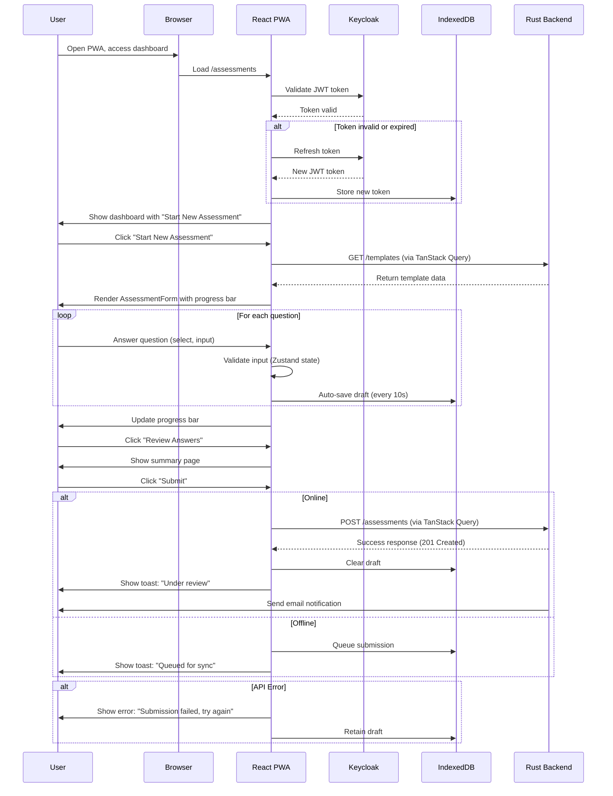

# Sustainability Assessment Tool: Frontend Architecture and Requirements

This document outlines the architectural design and requirements for the frontend of the Sustainability Assessment Tool, a React-based Progressive Web App (PWA) developed for DGRV to facilitate sustainability assessments for cooperatives in Southern Africa. It details user and admin interactions, frontend functionalities (including offline support and synchronization), and interactions with the Rust backend (via Open API) and Keycloak authentication service. The document aligns with the provided project structure, incorporates a real-world use case scenario, and uses TanStack Query for data fetching and Zustand for state management. Diagrams (in Mermaid syntax) illustrate key flows, and the architecture avoids code in diagrams, focusing on high-level design.

## Table of Contents

- [Sustainability Assessment Tool: Frontend Architecture and Requirements](#sustainability-assessment-tool-frontend-architecture-and-requirements)
  - [Table of Contents](#table-of-contents)
  - [1. Introduction and Goals](#1-introduction-and-goals)
    - [1.1 Scope](#11-scope)
    - [1.2 Goals and Constraints](#12-goals-and-constraints)
    - [1.3 Stakeholders](#13-stakeholders)
  - [2. Architecture Constraints](#2-architecture-constraints)
    - [2.1 Technology Stack](#21-technology-stack)
    - [2.2 Technical Constraints](#22-technical-constraints)
  - [3. Context and Scope](#3-context-and-scope)
    - [3.1 Business Context](#31-business-context)
    - [3.2 Technical Context](#32-technical-context)
  - [4. Solution Strategy](#4-solution-strategy)
    - [4.1 Architectural Decisions](#41-architectural-decisions)
  - [5. Functional Requirements and User Flows](#5-functional-requirements-and-user-flows)
    - [5.1 User and Admin Login](#51-user-and-admin-login)
    - [5.2 Admin Dashboard](#52-admin-dashboard)
    - [5.3 Organization Management](#53-organization-management)
    - [5.4 User Management](#54-user-management)
    - [5.5 Assessment Configuration](#55-assessment-configuration)
    - [5.6 System Settings](#56-system-settings)
    - [5.7 PWA Installation and Access](#57-pwa-installation-and-access)
    - [5.8 Assessment Creation and Submission](#58-assessment-creation-and-submission)
    - [5.9 Offline Functionality and Synchronization](#59-offline-functionality-and-synchronization)
    - [5.10 Assessment Review and Recommendations](#510-assessment-review-and-recommendations)
    - [5.11 Report Generation and Export](#511-report-generation-and-export)
    - [5.12 Sync Queue Management](#512-sync-queue-management)
  - [6. Non-Functional Requirements](#6-non-functional-requirements)
    - [6.1 Performance](#61-performance)
    - [6.2 Security](#62-security)
    - [6.3 Usability](#63-usability)
    - [6.4 Offline Reliability](#64-offline-reliability)
  - [7. Architecture Overview](#7-architecture-overview)
    - [7.1 Frontend Architecture Sequence Diagram](#71-frontend-architecture-sequence-diagram)
    - [7.2 Component Structure](#72-component-structure)
  - [8. Cross-Cutting Concepts](#8-cross-cutting-concepts)
    - [8.1 State Management](#81-state-management)
    - [8.2 Data Fetching](#82-data-fetching)
    - [8.3 Internationalization](#83-internationalization)
    - [8.4 Error Handling](#84-error-handling)
    - [8.5 Offline Support](#85-offline-support)
  - [9. Development and Testing](#9-development-and-testing)
    - [9.1 Development Setup](#91-development-setup)
    - [9.2 Testing Strategy](#92-testing-strategy)
  - [10. Risks and Mitigations](#10-risks-and-mitigations)
  - [11. Glossary](#11-glossary)
  - [12. References](#12-references)
  - [**13. Version History**](#13-version-history)

## 1. Introduction and Goals

### 1.1 Scope

The frontend is a React-based PWA that enables cooperative users to conduct sustainability assessments across environmental, financial, governance, and social dimensions, with offline support for regions with unreliable internet. Admins manage organizations, users, assessment templates, review submissions, and generate reports. The frontend integrates with a Rust backend (via Open API) and Keycloak for authentication, supporting multilingual interfaces and robust offline synchronization.

### 1.2 Goals and Constraints

- **Goals**:
  - Provide a responsive, multilingual PWA for cooperative users and admins.
  - Enable offline assessment creation and submission with reliable synchronization.
  - Support role-based access control (RBAC) for users (`Org_User`, `Org_Admin`, `Org_Expert`) and admins (`DGRV_Admin`).
  - Ensure fast load times (<2 seconds) and reliable API interactions (<500ms).
  - Deliver actionable reports with PDF/CSV exports and visualizations.
- **Constraints**:
  - Must operate offline in rural Southern Africa with intermittent connectivity.
  - Limited to browser-based technologies (React, PWA) for cross-platform support.
  - Multilingual support for English, German, Zulu, and French.
  - Must integrate with existing Rust backend and Keycloak.

### 1.3 Stakeholders

- **Cooperative Users**: Members of cooperatives (e.g., farmers) who create and submit assessments, view reports, and work offline.
- **DGRV Admins**: Sustainability officers who manage organizations, users, templates, review submissions, and generate reports.

## 2. Architecture Constraints

### 2.1 Technology Stack

- **Framework**: React (v18) with TypeScript for type safety.
- **Build Tool**: Vite for fast development and production builds.
- **PWA**: Vite PWA plugin for offline capabilities and service worker support.
- **Styling**: Tailwind CSS for responsive, utility-first styling.
- **State Management**: Zustand for lightweight, centralized state management.
- **Data Fetching**: TanStack Query for API calls and caching.
- **Internationalization**: i18next for multilingual support.
- **Storage**: IndexedDB (via `idb-keyval`) for offline data persistence.
- **API**: Open API client for Rust backend communication.
- **Authentication**: Keycloak for OAuth2-based authentication with JWT.
- **Testing**: Jest for unit tests, Cypress for E2E tests.
- **CI/CD**: GitHub Actions for automated linting, testing, and deployment.

### 2.2 Technical Constraints

- **Browser Compatibility**: Must support modern browsers (Chrome, Firefox, Safari) on desktop and mobile.
- **Offline Support**: Must store assessments and tokens locally, syncing when online.
- **Security**: Tokens and data must be encrypted in IndexedDB.
- **Performance**: Page loads <2 seconds, API responses <500ms.

## 3. Context and Scope

### 3.1 Business Context

The Sustainability Assessment Tool supports DGRV’s mission to enhance cooperative sustainability in Southern Africa. Cooperatives assess their practices, receiving actionable feedback to improve environmental, financial, governance, and social outcomes. Admins oversee the process, ensuring data quality and generating regional insights. The tool operates in regions with unreliable internet, requiring robust offline functionality.

### 3.2 Technical Context

The frontend is a React PWA It interacts with:

- **Keycloak**: Provides authentication via OAuth2, issuing JWT tokens.
- **Rust Backend**: Exposes Open API endpoints (`/assessments`, `/users`, `/organizations`, `/reports`, `/sync`) for data operations, storing data in PostgreSQL.
- **IndexedDB**: Stores tokens, drafts, and queued submissions locally.
- **Service Worker**: Caches assets for offline access.

## 4. Solution Strategy

### 4.1 Architectural Decisions

- **PWA Architecture**: Chosen for offline support, leveraging service workers and IndexedDB.
- **React with TypeScript**: Ensures maintainable, type-safe code.
- **TanStack Query**: Simplifies API fetching, caching, and retry logic.
- **Zustand**: Lightweight state management for auth and UI state.
- **i18next**: Supports multilingual interfaces for diverse users.
- **Modular Structure**: Separates user (`/src/user`) and admin (`/src/admin`) features for maintainability.
- **Open API Client**: Generated client ensures type-safe backend communication.
- **RBAC**: Enforced on frontend (via `ProtectedRoute`) and backend for security.

## 5. Functional Requirements and User Flows

This section details each feature, user/admin interactions, and corresponding sequence or flow diagrams, based on the use case scenario.

### 5.1 User and Admin Login

- **Description**: Users and admins log in via Keycloak, with multilingual support and 2FA for admins.
- **User Flow**:
  - Admins access the admin URL, enter credentials, complete 2FA, and view the dashboard in their preferred language.
  - Users access the PWA URL, log in, set a new password (if first login), select a language, and view their dashboard.
- **Sequence Diagram**:
  ```mermaid
  sequenceDiagram
      participant User as User/Admin
      participant Browser
      participant ReactApp as React PWA
      participant Keycloak
      User->>Browser: Visit PWA or admin URL
      Browser->>ReactApp: Load App
      ReactApp->>Keycloak: Check session
      Keycloak-->>ReactApp: No session
      ReactApp->>Browser: Redirect to /login
      User->>Browser: Enter credentials, select language
      Browser->>Keycloak: Submit credentials
      Keycloak->>Browser: Prompt 2FA (admin only)
      User->>Browser: Complete 2FA
      Keycloak->>ReactApp: Issue JWT tokens
      ReactApp->>Browser: Store tokens in IndexedDB
      ReactApp->>Browser: Redirect to /assessments (user) or /admin (admin)
  ```

### 5.2 Admin Dashboard

- **Description**: Displays real-time insights (active organizations, submissions, pending reviews).
- **User Flow**:
  - Admins see a line graph (e.g., 45 organizations, 22 submissions), a notification badge (e.g., 3 pending reviews), and sidebar links.
- **Flow Diagram**:
  ```mermaid
  graph TD
      A[Admin Dashboard] --> B[Line Graph: Orgs, Submissions]
      A --> C[Notification Badge: Pending Reviews]
      A --> D[Sidebar: Org Management]
      A --> E[Sidebar: User Management]
      A --> F[Sidebar: Assessment Config]
      A --> G[Sidebar: Submissions]
      A --> H[Sidebar: Reports]
      A --> I[Sidebar: Sync Queue]
  ```

### 5.3 Organization Management

- **Description**: Admins create/edit organizations.
- **User Flow**:
  - Admins select “Organization Management,” enter details (e.g., name, location, email), and save, updating the backend.
- **Sequence Diagram**:
  ```mermaid
  sequenceDiagram
      participant Admin
      participant ReactApp as Admin PWA
      participant Backend as Rust Backend
      Admin->>ReactApp: Select "Organization Management"
      ReactApp->>Admin: Show form
      Admin->>ReactApp: Enter org details
      ReactApp->>Backend: POST /organizations
      Backend-->>ReactApp: Success
      ReactApp->>Admin: Show toast: "Organization created"
  ```

### 5.4 User Management

- **Description**: Admins add/edit users and assign roles.
- **User Flow**:
  - Admins filter by organization, add users (e.g., email, role: `Org_User`), triggering email invitations.
- **Sequence Diagram**:
  ```mermaid
  sequenceDiagram
      participant Admin
      participant ReactApp as Admin PWA
      participant Backend as Rust Backend
      Admin->>ReactApp: Select "User Management"
      ReactApp->>Admin: Show form
      Admin->>ReactApp: Enter user details, role
      ReactApp->>Backend: POST /users
      Backend-->>ReactApp: Success
      Backend->>User: Send email invitation
      ReactApp->>Admin: Show toast: "User added"
  ```

### 5.5 Assessment Configuration

- **Description**: Admins configure assessment templates with multilingual questions.
- **User Flow**:
  - Admins edit templates, add questions (e.g., diversity policy in English/Zulu), and save.
- **Sequence Diagram**:
  ```mermaid
  sequenceDiagram
      participant Admin
      participant ReactApp as Admin PWA
      participant Backend as Rust Backend
      Admin->>ReactApp: Select "Assessment Configuration"
      ReactApp->>Backend: GET /templates
      Backend-->>ReactApp: Return templates
      ReactApp->>Admin: Show editor
      Admin->>ReactApp: Add question
      ReactApp->>Backend: PATCH /templates/:id
      Backend-->>ReactApp: Success
      ReactApp->>Admin: Show toast: "Template updated"
  ```

### 5.6 System Settings

- **Description**: Admins configure languages, report formats, and sync settings.
- **User Flow**:
  - Admins verify settings (languages, PDF/CSV exports, auto-sync, notifications).
- **Flow Diagram**:
  ```mermaid
  graph TD
      A[System Settings] --> B[Languages]
      A --> C[Report Formats]
      A --> D[Sync Settings]
      A --> E[Notifications]
  ```

### 5.7 PWA Installation and Access

- **Description**: Users install the PWA for offline use.
- **User Flow**:
  - Users access the PWA URL, install the app, and view their dashboard with an offline indicator.
- **Sequence Diagram**:
  ```mermaid
  sequenceDiagram
      participant User
      participant Browser
      participant ReactApp as React PWA
      User->>Browser: Open PWA URL
      Browser->>ReactApp: Load PWA
      ReactApp->>Browser: Prompt "Install PWA"
      User->>Browser: Install
      Browser->>User: Add app icon
      User->>Browser: Open app
      ReactApp->>User: Show dashboard
  ```

### 5.8 Assessment Creation and Submission

- **Description**: Users create and submit assessments with draft saving.
- **User Flow**:
  - Users select a template, answer questions, save drafts, and submit, receiving “under review” confirmation.
- **Sequence Diagram**:



### 5.9 Offline Functionality and Synchronization

- **Description**: Users work offline, with assessments synced when online.
- **User Flow**:
  - Users continue answering offline, save drafts, and sync automatically when online.
- **Sequence Diagram**:
  ```mermaid
  sequenceDiagram
      participant User
      participant ReactApp as React PWA
      participant IndexedDB
      participant Backend as Rust Backend
      User->>ReactApp: Answer questions (offline)
      ReactApp->>IndexedDB: Save assessment
      ReactApp->>User: Show "Offline mode"
      Note over ReactApp: Connectivity restored
      ReactApp->>IndexedDB: Retrieve assessments
      ReactApp->>Backend: POST /assessments/sync
      Backend-->>ReactApp: Success
      ReactApp->>IndexedDB: Clear queue
      ReactApp->>User: Show "Synced"
  ```

### 5.10 Assessment Review and Recommendations

- **Description**: Admins review submissions and add recommendations.
- **User Flow**:
  - Admins review submissions, add recommendations, and submit reports.
- **Sequence Diagram**:
  ```mermaid
  sequenceDiagram
      participant Admin
      participant ReactApp as Admin PWA
      participant Backend as Rust Backend
      Admin->>ReactApp: Select "Submissions"
      ReactApp->>Backend: GET /assessments?status=pending
      Backend-->>ReactApp: Return submissions
      Admin->>ReactApp: Review submission
      ReactApp->>Admin: Show responses
      Admin->>ReactApp: Add recommendations
      ReactApp->>Backend: PATCH /assessments/:id
      Backend-->>ReactApp: Success
      Admin->>ReactApp: Submit report
      ReactApp->>Backend: POST /reports
      Backend-->>ReactApp: Success
      ReactApp->>Admin: Show "Report submitted"
  ```

### 5.11 Report Generation and Export

- **Description**: Users view/download reports; admins generate aggregate reports.
- **User Flow**:
  - Users view reports with scores and recommendations, export as PDF. Admins generate aggregate reports (CSV).
- **Sequence Diagram**:
  ```mermaid
  sequenceDiagram
      participant User as User/Admin
      participant ReactApp as React PWA
      participant Backend as Rust Backend
      User->>ReactApp: Select "Reports"
      ReactApp->>Backend: GET /reports
      Backend-->>ReactApp: Return report data
      ReactApp->>User: Show report
      User->>ReactApp: Export PDF
      ReactApp->>User: Download PDF
  ```

### 5.12 Sync Queue Management

- **Description**: Admins monitor and trigger syncs for stuck submissions.
- **User Flow**:
  - Admins check the sync queue and trigger manual syncs.
- **Sequence Diagram**:
  ```mermaid
  sequenceDiagram
      participant Admin
      participant ReactApp as Admin PWA
      participant Backend as Rust Backend
      Admin->>ReactApp: Select "Sync Queue"
      ReactApp->>Backend: GET /sync-queue
      Backend-->>ReactApp: Return pending syncs
      Admin->>ReactApp: Trigger manual sync
      ReactApp->>Backend: POST /sync/retry
      Backend-->>ReactApp: Success
      ReactApp->>Admin: Show "Sync completed"
  ```

## 6. Non-Functional Requirements

### 6.1 Performance

- **Load Time**: Initial load <2 seconds, navigation <500ms.
- **Offline Operations**: Form submission/save <500ms.
- **API Calls**: Backend responses <500ms (online).

### 6.2 Security

- **Authentication**: JWT-based, encrypted in IndexedDB.
- **RBAC**: Enforced on frontend and backend.
- **Data Encryption**: Assessments encrypted in IndexedDB.

### 6.3 Usability

- **Responsive Design**: Tailwind CSS for mobile/desktop.
- **Multilingual**: Supports English, German, Zulu, French.
- **Accessibility**: ARIA attributes, keyboard navigation.

### 6.4 Offline Reliability

- **Data Persistence**: Assessments persist across restarts.
- **Sync Success**: >95% success rate.
- **Offline Indicator**: Real-time connectivity feedback.

## 7. Architecture Overview

### 7.1 Frontend Architecture Sequence Diagram

The sequence diagram illustrates the core interactions between the PWA (serving both users and admins), Keycloak authentication service, and Rust backend (via Open API services). It covers authentication, assessment creation and submission, organization and user management, template configuration, review, reporting, and sync queue management in a simplified flow, focusing on essential data interactions and offline capabilities.

```mermaid
sequenceDiagram
    participant Admin as Admin
    participant User as User
    participant PWA as PWA
    participant IndexedDB
    participant Keycloak
    participant Backend as Rust Backend

    %% ===================================================================
    %% PHASE 1: ADMIN AUTHENTICATION & SETUP
    %% ===================================================================

    Note over Admin,Backend: 🔐 ADMIN PRIMARY AUTHENTICATION
    %% Admin Login (Primary Authentication)
    Admin->>PWA: Open PWA URL
    PWA->>Keycloak: Validate admin JWT
    Keycloak-->>PWA: Valid JWT + Admin role confirmed
    PWA->>IndexedDB: Store JWT + admin role
    PWA->>Admin: Show admin dashboard

    Note over Admin,Backend: 🏢 ORGANIZATION MANAGEMENT
    %% Admin Creates Organization
    Admin->>PWA: Create organization
    PWA->>Admin: Show organization form
    Admin->>PWA: Enter org details (name, domain, settings)
    PWA->>Backend: POST /organizations
    Backend-->>PWA: Organization created with ID
    PWA->>Admin: Show "Organization created successfully"

    Note over Admin,Keycloak: 👥 USER CREATION & CREDENTIAL ASSIGNMENT
    %% Admin Creates Users & Assigns Credentials
    Admin->>PWA: Manage users for organization
    PWA->>Backend: GET /organizations (admin scope)
    Backend-->>PWA: Return admin's organizations
    PWA->>Admin: Show user management interface
    Admin->>PWA: Add new user to organization
    PWA->>Admin: Show user creation form
    Admin->>PWA: Enter user details + assign role
    Note over Admin,PWA: Admin creates username/password<br/>and assigns role (assessor, reviewer, etc.)
    PWA->>Backend: POST /users (with org_id, credentials, role)
    Backend->>Keycloak: Create user account in realm
    Keycloak-->>Backend: User created with credentials
    Backend-->>PWA: User created successfully
    PWA->>Admin: Show "User created - credentials ready"
    Admin->>PWA: Generate user credentials document
    PWA->>Admin: Provide credentials to give to user

    %% ===================================================================
    %% PHASE 2: USER AUTHENTICATION WITH ADMIN-PROVIDED CREDENTIALS
    %% ===================================================================

    Note over User,Backend: 🔑 USER AUTHENTICATION (ADMIN-PROVIDED CREDENTIALS)
    %% User Login (Secondary Authentication)
    Note over User,PWA: User receives credentials from Admin
    User->>PWA: Open PWA URL
    PWA->>User: Show login form
    User->>PWA: Enter admin-provided credentials
    PWA->>Keycloak: Authenticate with user credentials
    Keycloak-->>PWA: Valid JWT + User role + Organization context
    PWA->>IndexedDB: Store JWT + user role + org_id
    PWA->>Backend: GET /user/profile (validate org membership)
    Backend-->>PWA: User profile + organization context
    PWA->>User: Show user dashboard (scoped to organization)

    %% ===================================================================
    %% PHASE 3: USER WORKFLOWS (POST-AUTHENTICATION)
    %% ===================================================================

    Note over User,Backend: 📝 ASSESSMENT SUBMISSION
    %% User Assessment Submission
    User->>PWA: Start assessment
    PWA->>Backend: GET /templates?org_id=user_org
    Backend-->>PWA: Return organization's templates
    PWA->>User: Show assessment form
    User->>PWA: Answer questions
    PWA->>IndexedDB: Save draft (with org context)
    User->>PWA: Submit assessment
    alt Online
        PWA->>Backend: POST /assessments (with org_id, user_id)
        Backend-->>PWA: Assessment submitted
        PWA->>IndexedDB: Clear draft
        PWA->>User: Show "Assessment submitted - Under review"
    else Offline
        PWA->>IndexedDB: Queue submission (with org context)
        PWA->>User: Show "Assessment queued for sync"
    end

    Note over User,Backend: 📊 USER REPORT VIEWING (ADMIN-GENERATED ONLY)
    %% User View Own Reports (Only After Admin Review & Report Generation)
    User->>PWA: View my reports
    PWA->>Backend: GET /reports?user_id=current_user&status=completed
    alt Reports Available (Admin Generated)
        Backend-->>PWA: Return completed reports with recommendations
        PWA->>User: Show personal reports with admin recommendations
    else No Reports Available
        Backend-->>PWA: Return empty/pending status
        PWA->>User: Show "No reports available - assessments under review"
    end

    %% ===================================================================
    %% PHASE 4: ADMIN MANAGEMENT WORKFLOWS (POST USER CREATION)
    %% ===================================================================

    Note over Admin,Keycloak: ⚙️ ONGOING USER MANAGEMENT
    %% Admin User Management (Ongoing)
    Admin->>PWA: Manage existing users
    PWA->>Backend: GET /users?org_id=admin_orgs
    Backend-->>PWA: Return users in admin's organizations
    PWA->>Admin: Show user list
    Admin->>PWA: Edit user role/permissions
    PWA->>Backend: PATCH /users/:id (update role)
    Backend->>Keycloak: Update user role in realm
    Keycloak-->>Backend: Role updated
    Backend-->>PWA: User updated
    PWA->>Admin: Show "User permissions updated"


    Note over Admin,User: ✅ ASSESSMENT REVIEW & REPORT GENERATION
    %% Admin Assessment Review (Organization Scoped)
    Admin->>PWA: Review submissions
    PWA->>Backend: GET /assessments?status=pending&org_id=admin_org
    Backend-->>PWA: Return pending assessments in organization
    PWA->>Admin: Show submissions for review
    Admin->>PWA: Review and add recommendations
    PWA->>Backend: PATCH /assessments/:id (approve with recommendations)
    Backend-->>PWA: Assessment reviewed
    Admin->>PWA: Generate user report
    PWA->>Backend: POST /reports/generate (user_id, assessment_id, recommendations)
    Backend-->>PWA: Report generated and ready for user
    Backend->>User: Notify user of completed report (if online)
    PWA->>Admin: Show "Assessment reviewed and report generated for user"

    Note over Admin,Backend: 📈 ORGANIZATION REPORTING
    %% Admin Organization Reports
    Admin->>PWA: View organization reports
    PWA->>Backend: GET /reports?org_id=admin_org&scope=organization
    Backend-->>PWA: Return organization-wide reports
    PWA->>Admin: Show organization analytics
    Admin->>PWA: Generate compliance report
    PWA->>Backend: POST /reports/generate (org scope)
    Backend-->>PWA: Generated report
    PWA->>Admin: Show/Export organization report

    %% ===================================================================
    %% PHASE 5: OFFLINE SYNC (ROLE & ORGANIZATION AWARE)
    %% ===================================================================

    Note over PWA,Backend: 🔄 OFFLINE SYNCHRONIZATION
    Note over PWA: Connectivity restored
    PWA->>IndexedDB: Retrieve queued items
    alt User sync
        PWA->>Keycloak: Validate user JWT
        Keycloak-->>PWA: Valid JWT + User permissions
        PWA->>Backend: POST /assessments/sync (user data with org_id)
        Backend-->>PWA: User data synced
        PWA->>IndexedDB: Clear user queue
        PWA->>User: Show "Your assessments synced"
    else Admin sync
        PWA->>Keycloak: Validate admin JWT
        Keycloak-->>PWA: Valid JWT + Admin permissions
        PWA->>Backend: POST /admin/sync (org management operations)
        Backend-->>PWA: Admin operations synced
        PWA->>IndexedDB: Clear admin queue
        PWA->>Admin: Show "Organization management synced"
    end
```



### 7.2 Component Structure

```
/frontend
├── /public                # Static assets (icons, manifest.json, favicon)
├── /src
│   ├── /admin             # Admin-specific features
│   │   ├── /components    # Admin UI components (e.g., UserManagement, QuestionManager)
│   │   ├── /pages         # Admin page components (e.g., AdminDashboard, UserReports)
│   │   ├── /services      # Admin-specific API clients
│   │   ├── /i18n          # Admin-specific translations
│   │   ├── /assets        # Admin-specific images, styles
│   │   ├── /hooks         # Admin-specific custom hooks (e.g., useAdminAuth, useUserData)
│   │   └── /tests         # Admin-specific unit and component tests
│   ├── /user              # User-specific features (PWA-focused)
│   │   ├── /components    # User UI components (e.g., AssessmentForm, Dashboard)
│   │   ├── /pages         # User page components (e.g., Login, Assessment, Reports)
│   │   ├── /services      # User-specific API clients and offline sync logic
│   │   ├── /i18n          # User-specific translations
│   │   ├── /assets        # User-specific images, styles
│   │   ├── /hooks         # User-specific custom hooks (e.g., useAuth, useOfflineSync)
│   │   └── /tests         # User-specific unit and component tests
│   ├── /shared            # Shared components and utilities
│   │   ├── /components    # Common UI components (e.g., NavBar, LoadingSpinner)
│   │   ├── /utils         # Shared helpers (e.g., API wrappers, formatters)
│   │   ├── /hooks         # Shared custom hooks (e.g., useApi, useTheme)
│   │   └── /tests         # Tests for shared components and utilities
│   ├── App.tsx            # Main app component with routing for admin and user
│   ├── index.tsx          # Entry point for the application
│   └── /tests             # Application-wide tests
├── /docs                  # Centralized documentation (e.g., setup, component guides, API usage)
├── /.github               # Centralized GitHub configurations
│   ├── /workflows         # CI/CD pipelines (e.g., lint, test, build)
│   └── ci.yml             # cicd worflow
├── package.json           # Centralized Node dependencies
├── tsconfig.json          # Centralized TypeScript configuration
├── Dockerfile             # Centralized Docker configuration
└── serviceWorker.ts       # Centralized service worker for PWA and caching
```

## 8. Cross-Cutting Concepts

### 8.1 State Management

- **Zustand**: Centralized store for auth (tokens, user roles), UI state (language, theme), and offline status.
- **Example**: Auth store manages JWTs, accessible via `useAuthStore`.

### 8.2 Data Fetching

- **TanStack Query**: Handles API calls, caching, and retries.
- **Example**: `useQuery` for fetching templates, with offline fallback to IndexedDB.

### 8.3 Internationalization

- **i18next**: Manages translations (English, German, Zulu, French).
- **Example**: Question text stored in `/src/user/i18n` and `/src/admin/i18n`.

### 8.4 Error Handling

- **Error Boundary**: Catches runtime errors, displays user-friendly messages.
- **API Errors**: TanStack Query retries failed requests, shows alerts.

### 8.5 Offline Support

- **Service Worker**: Caches assets for offline access.
- **IndexedDB**: Stores drafts, queued submissions.
- **Sync Logic**: Queues submissions, syncs when online.

## 9. Development and Testing

### 9.1 Development Setup

- **Dependencies**:
  ```bash
  npm install
  ```
- **Run**:
  ```bash
  npm run dev
  ```
- **Environment**:
  ```env
  VITE_BACKEND_URL=http://localhost:8000
  ```

### 9.2 Testing Strategy

- **Unit Tests**: Jest for components (`AssessmentForm`, `AdminDashboard`).
- **E2E Tests**: Cypress for login, assessment, sync, and report flows.
- **CI/CD**: GitHub Actions for linting, testing, and deployment.

## 10. Risks and Mitigations

- **Risk**: Offline data loss.
  - **Mitigation**: Robust IndexedDB storage, sync retries.
- **Risk**: API downtime.
  - **Mitigation**: TanStack Query caching, offline fallbacks.
- **Risk**: Multilingual inconsistencies.
  - **Mitigation**: Centralized i18next translations, testing.

## 11. Glossary

- **PWA**: Progressive Web App.
- **JWT**: JSON Web Token.
- **IndexedDB**: Browser database.
- **RBAC**: Role-Based Access Control.
- **Open API**: Specification for backend APIs.

## 12. References

- React: [react.dev](https://react.dev)
- TanStack Query: [tanstack.com/query](https://tanstack.com/query)
- Zustand: [zustand-demo.pmnd.rs](https://zustand-demo.pmnd.rs)
- Vite PWA: [vite-pwa.org](https://vite-pwa.org)
- i18next: [i18next.com](https://i18next.com)

## **13. Version History**

| Version | Date       | Author | Changes                                                                    |
| :------ | :--------- | :----- | :------------------------------------------------------------------------- |
| 1.0     | 2025-06-26 | Ariel  | Initial version of the DGRV-sustainability frontend architecture document. |
